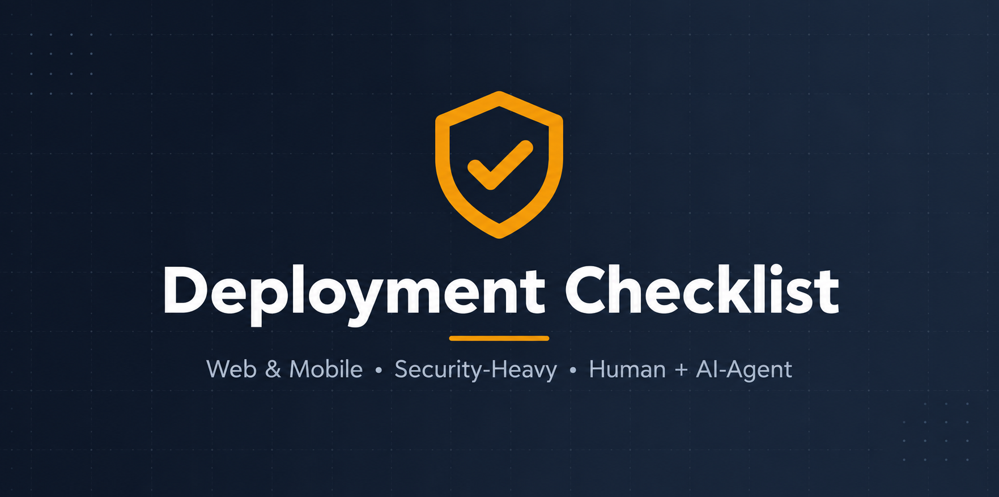

# Deployment Checklist

A reusable, language- and framework-agnostic checklist to run before **every** production deploy. Covers web apps and mobile apps, with a deep, audit-grade security section (threat model, OWASP Web + Mobile Top 10, secrets, compliance, incident response).

Works for any stack. Run it by hand, or hand it to an AI coding agent. Stack-specific checklists extend the base — and contributions are welcome.

## Layout

```
README.md            you are here
agent.md             how an AI agent runs the checklist (prompt + output contract)
CONTRIBUTING.md      how to add a stack-specific checklist
checklists/
  base.md            the base checklist — applies to ANY stack (start here)
  _template.md       skeleton to copy when adding a stack checklist
  go.md              (example) Go-specific extras — extends base
  java.md            (example) Java-specific extras — extends base
```

The **base** checklist is universal. A **stack** checklist (`go.md`, `java.md`, …) *adds* items on top of the base for one language or ecosystem — it never replaces it. Run the base first, then any stack file that matches your project.

## Two ways to use it

| Path | For | What it is |
|------|-----|------------|
| [checklists/base.md](./checklists/base.md) | **Humans** | The checklist itself — tick the `- [ ]` boxes, sign off, deploy. Source of truth for *what* to verify. |
| [agent.md](./agent.md) | **AI agents** | A copy-paste prompt + output contract so a coding agent (Claude Code, Cursor, Copilot, etc.) audits your repo against the checklist and returns a GO / NO-GO verdict. |

## Quick start

**By hand:** open [checklists/base.md](./checklists/base.md), copy it per release, tick each box. Any unchecked `[BLOCKER]` = no deploy. Add a matching stack file if one exists.

**With an AI agent:** open [agent.md](./agent.md), copy the prompt into your agent inside the repo you're deploying. It fetches the base (plus any matching stack checklist), audits, cites evidence, and returns GO / NO-GO.

## Severity

| Mark | Meaning |
|------|---------|
| `[BLOCKER]` | Do not deploy until fixed |
| `[SHOULD]` | Deploy only with a tracked ticket + owner |
| `[NICE]` | Improve when time allows |

## Sections in the base checklist

1. Shared / Universal (build, secrets, auth, data, observability, testing, dependencies)
2. Web-Specific (headers, TLS, CORS, XSS/CSRF/SSRF, abuse protection, client bundle)
3. Mobile-Specific (signing, permissions, secure storage, network, anti-tampering)
4. Security — Audit-Grade (threat model, OWASP Web + Mobile Top 10, secrets/KMS, pentest, compliance, incident response)
5. Sign-off
6. References

## Contributing

Want a Go, Java, Python, Rust, or framework-specific checklist? See [CONTRIBUTING.md](./CONTRIBUTING.md) — copy [checklists/_template.md](./checklists/_template.md), add your items, open a PR.

## License / reuse

Copy, fork, adapt. Keep [checklists/base.md](./checklists/base.md) as the source of truth and let stack files extend it, so everything stays in sync.
